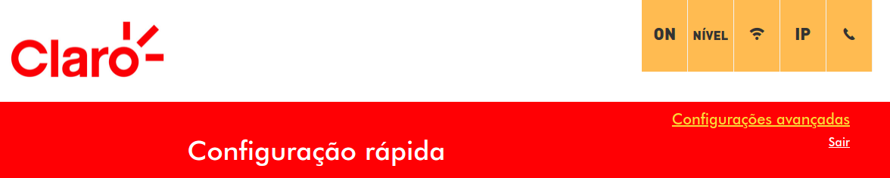

## Pré-requisito
* Descubra seu **IP na rede local** e **MAC address**
  * 
  * 
* Porta da aplicação
  * Procure no google para descobrir a porta da aplicação
    * **SSH**: 22  
    * **VNC**: 5900  
* Descubra o seu **IP público** utilizando algum site na internet

## Configurar Roteador [exemplo 1]
* Acesse http://192.168.0.1/  
* Logue na conta admin do seu roteador  
  * A conta admin pode ser uma padrão da máquina  
    * **Mude a senha se for o caso, é muito perigoso deixar a senha padrão**
  * A conta admin pode estar escrita em algum lugar do seu roteador (olhe embaixo dele)  
  * Sua operadora pode ter lhe passado em algum lugar a conta admin e senha  
  *   
* Vá na tab **Advanced**  
  *   
* Selecione **Forwarding**
  * 
* Selecionoe **Create IPv4** ou **Create IPv6**
  * Só lembre de usar o IP relacionado a opção criada
* Preencha as informações
  * **Local IP**: IP da sua máquina na rede local
  * **Local Start Port**: Porta utilizada pela aplicação
  * **Local End Port**: Porta utilizada pela aplicação
  * **External IP**: 0.0.0.0
  * **External Start Port**: Porta utilizada pela aplicação
  * **External End Port**: Porta utilizada pela aplicação
  * **Protocol**: TCP
  * **Enabled**: On
* Clique em **Apply**
* Selecione **Port Triggers**
  *   
* Selecione **Create**
* Preencha as informações
  * **Trigger Start Port**: Porta utilizada pela aplicação
  * **Trigger End Port**: Porta utilizada pela aplicação
  * **Target Start Port**: Porta utilizada pela aplicação
  * **Target End Port**: Porta utilizada pela aplicação
  * **Protocol**: TCP
  * **Enabled**: On
* Clqiue em **Apply**

## Configurar Roteador [exemplo 2]
* Acesse http://192.168.0.1/  
* Logue na conta admin do seu roteador  
  * A conta admin pode ser uma padrão da máquina  
    * **Mude a senha se for o caso, é muito perigoso deixar a senha padrão**
  * A conta admin pode estar escrita em algum lugar do seu roteador (olhe embaixo dele)  
  * Sua operadora pode ter lhe passado em algum lugar a conta admin e senha  
  *   
* Clique em **Configurações avançadas**  
  *   
* Abra o menu
  * 
* Selecione **Avancado**  
  * 
* Selecione **Encaminhamento de porta**
  * 
* Selecione **Adicionar/Remover**
  * 
* Crie o encaminhamento desejado
  * 
  * **Seviço customizado**: Escolha o nome para o seu serviço
  * **Endereço IP so servidor**: IP local
  * **Porta externa inicial**: Porta utilizada pela aplicação
  * **Porta externa final**: Porta utilizada pela aplicação
  * **Endereço IP externo**: Vazio quer dizer que qualquer IP externo pode acessar
  * **Protocolo**: Protocol utilizado pela aplicação (em caso de dúvida "TCP/UDP")
  * **Porta inicial interna**: Porta utilizada pela aplicação
  * **Porta final interna**: Porta utilizada pela aplicação
* Clique em **Aplicar ajustes**
* Abra o menu novamente
  * 
* Selecione **Port trigger**
  * 
* Clique em **Criar**
  * 
* Crie o gatilho desejado
  * 
  * **Aplicativo personalizado**: Escolha o nome para seu aplicativo
  * **Gatilho porta inicial**: Porta utilizada pela aplicação
  * **Gatilho porta final**: Porta utilizada pela aplicação
  * **Gatilho protocolo**: Protocol utilizado pela aplicação (em caso de dúvida "TCP/UDP")
  * **Alvo porta inicial**: Porta utilizada pela aplicação
  * **Alvo porta inicial**: Porta utilizada pela aplicação
  * **Alvo protocolo**: Protocol utilizado pela aplicação (em caso de dúvida "TCP/UDP")
* Clique **Adicionar**
* Abra o menu novamente
  * 
* Selecione **DMZ host**
  * 
* Bote o **IP local**
  * 
