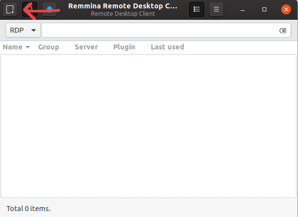
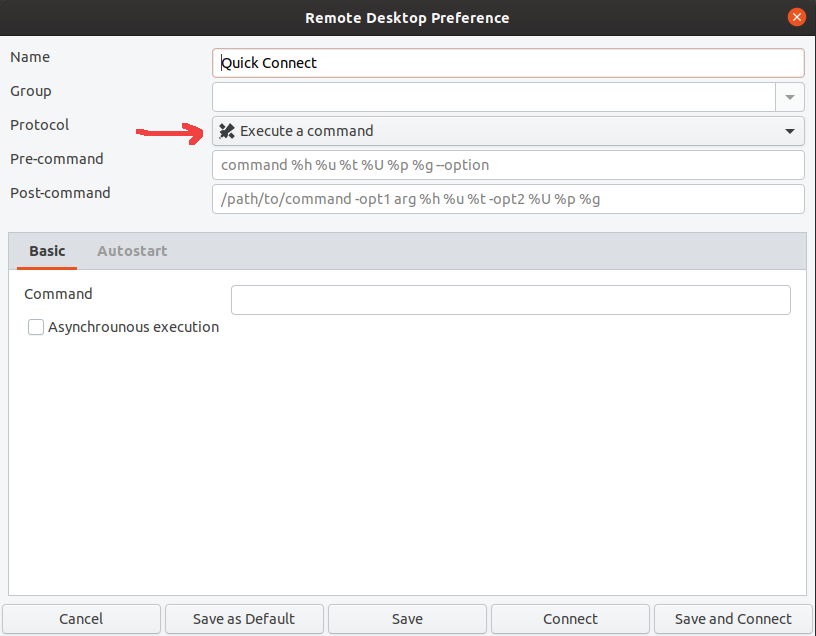
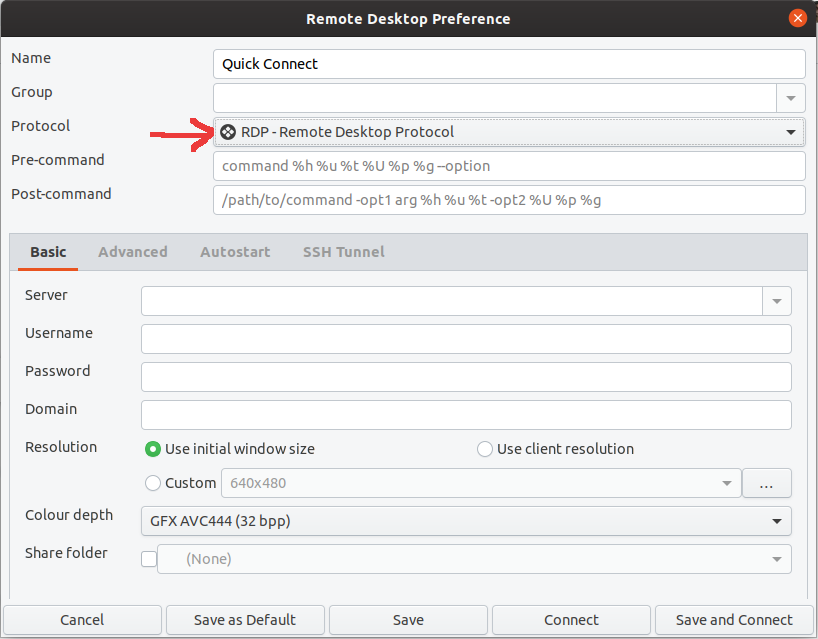
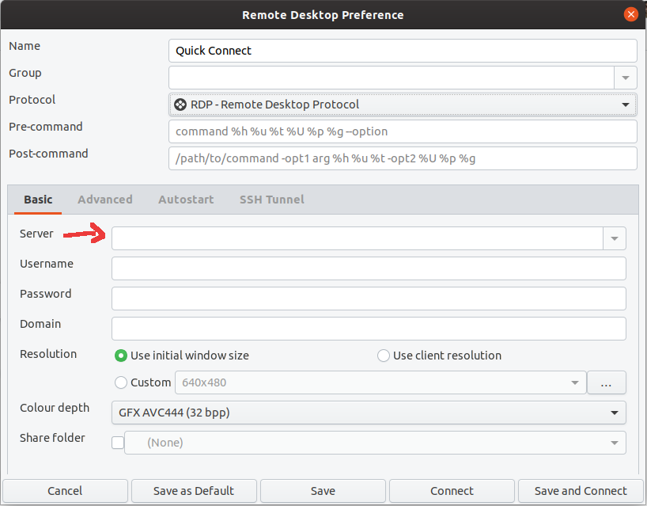
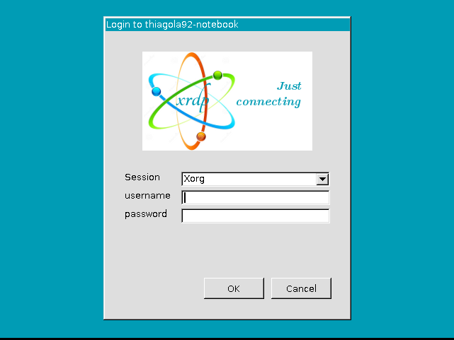

# Client
* Instalar Remmina
  * Vem instalado no Ubuntu normal, mas não na instalação mínima  
  * `sudo snap install remmina`  
* Abrir Remmina
* Criar nova conexão
  * 
* Selecionar o protocolo RDP    
  *   
  *   
* Inserir o IP  
  *   
* Clicar no botão de conectar  
* Preencher com o login e senha de um usuário do computador  
  * O usuário **não** pode estar logado  
  * 

# Server
* Instalar Xrdp
  * `sudo apt install xrdp`  
* Verificar se está executando
  * `systemctl status xrdp`
  * Se não estiver
    * `systemctl start xrdp`  
    * Abrir automaticamente na inicialização do sistema
      * `systemctl enable xrdp`  

# Font
https://websiteforstudents.com/connect-to-ubuntu-16-04-17-10-18-04-desktop-via-remote-desktop-connection-rdp-with-xrdp/  