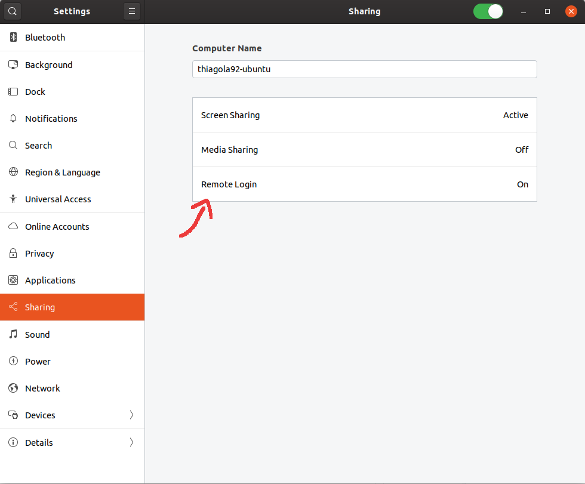
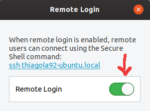

# Client
* Instalar OpenSSH Client  
  * Vem instalado no Ubuntu
  * `sudo apt install openssh-client`  
* Conectar a outra máquina
  * `ssh <user>@<ip>`  
    * **user**: Usuário do computador (usuário que você utiliza para logar)  
    * **ip**: IP da máquina  
  * Digite a senha do usuário
  * Confirme a criação de chave
    * Apenas necessário na primeira vez que fizer conexão

# Server
* Instalar OpenSSH Server  
  * `sudo apt install openssh-server`  
* Verificar se está executando
  * `systemctl status sshd`
  * Se não estiver
    * `systemctl start sshd`  
    * Abrir automaticamente na inicialização do sistema
      * `systemctl enable sshd`  
* Abrir configurações do Ubuntu
* Selecionar "Sharing"
* Selecionar "Remote Login"
  *   
* Permitir login por ssh
  *   

# Font
https://likegeeks.com/ssh-connection-refused/  