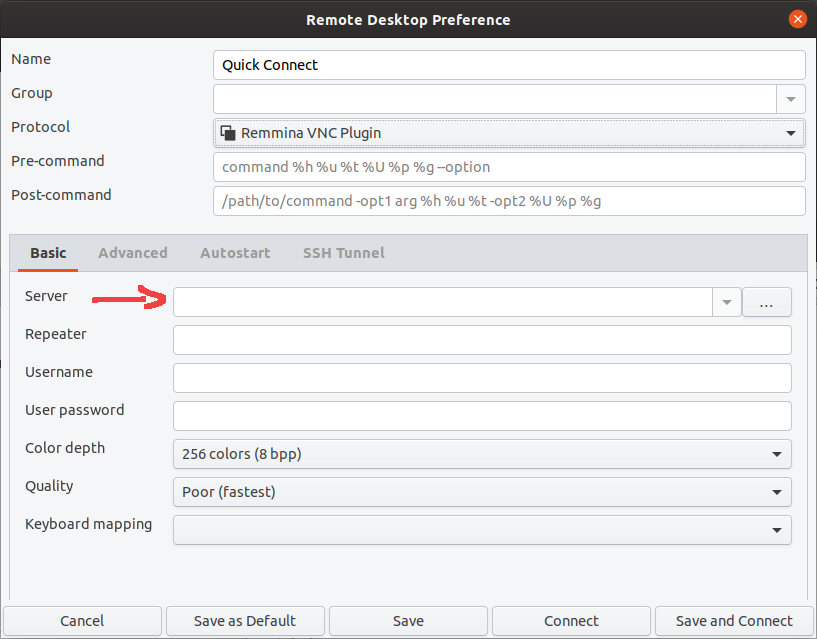

# Client
* Instalar Remmina
  * Vem instalado no Ubuntu normal, mas não na instalação mínima  
  * `sudo snap install remmina`  
* Abrir Remmina
* Criar nova conexão
  * 
* Selecionar o protocolo VNC  
  *   
  *   
* Inserir o IP  
  *   
* Clicar no botão de conectar  
* Dependendo de como o server tiver configurado  
  * Ou ele precisa te dar permissão na hora para se conectar  
  * Ou você apenas precisa fornecer uma senha  

# Server
* Instalar Vino
  * Vem instalado no Ubuntu normal, mas não na instalação mínima  
  * `sudo apt install vino`  
* Abrir configurações do Ubuntu
* Selecionar "Sharing"
* Selecionar "Screen Sharing"
  *   
* Permitir compartilhamento de tela e configurar como desejar
  *   
